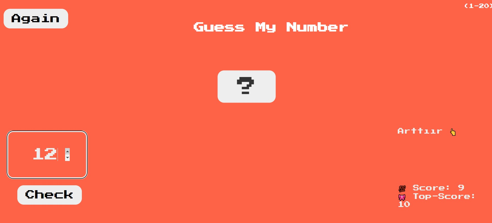

# Number Guessing Game

This simple web application allows the user to guess a randomly selected number within a specified range.



## Technologies Used

This project utilizes the following technologies:

- HTML
- CSS (Cascading Style Sheets)
- JavaScript

## Installation and Running

1. Download or clone the project files to your computer.
2. Navigate to the downloaded directory:

    ```bash
    cd number-guessing-game
    ```

3. Open the `index.html` file in a web browser to run the application.

## Live Demo

You can experience the application live [here](https://sayi-tahmin-oyunu.vercel.app/).

## Contributing

If you'd like to contribute, please feel free to submit a pull request. Your feedback and suggestions are welcome and will contribute to the improvement of the project.

